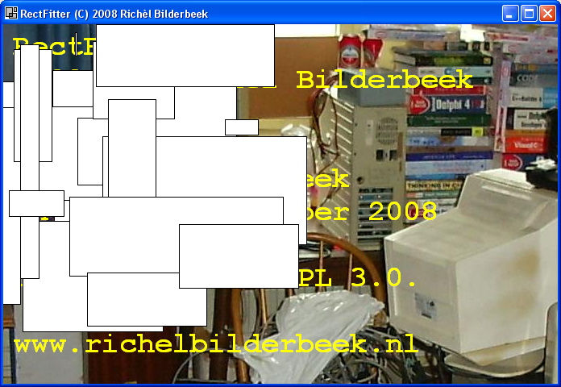

# RectFitter

RectFitter is a tool to demonstrate how to fit rectangles within a rectangle.

RectFitter is programmed in C++ using the IDE C++ Builder 6.0. It uses the STL, VCL and Boost libraries.

 * [Download the Windows executable](ToolRectFitterExe_1_0.zip)

